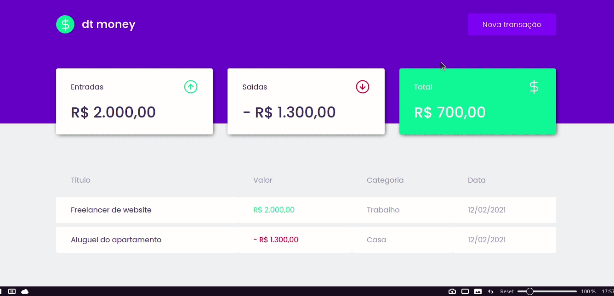

<p align="center">
<svg width="32" height="32" viewBox="0 0 32 32" fill="white" x#000="http://www.w3.org/2000/svg">
<path d="M16 1.33333V30.6667" stroke="green" stroke-width="2" stroke-linecap="round" stroke-linejoin="round"/>
<path d="M22.6667 6.66667H12.6667C11.429 6.66667 10.242 7.15834 9.36684 8.03351C8.49167 8.90868 8 10.0957 8 11.3333C8 12.571 8.49167 13.758 9.36684 14.6332C10.242 15.5083 11.429 16 12.6667 16H19.3333C20.571 16 21.758 16.4917 22.6332 17.3668C23.5083 18.242 24 19.429 24 20.6667C24 21.9043 23.5083 23.0913 22.6332 23.9665C21.758 24.8417 20.571 25.3333 19.3333 25.3333H8" stroke="green" stroke-width="2" stroke-linecap="round" stroke-linejoin="round"/>
</svg>

</p>


<h1 align="center">
  dt money
</h1>

<p align="center">
  o dt money é um aplicativo muito simples para fazer cadastro de transações financeiras.
  O meu objetivo ao desenvolvê-lo foi trabalhar com cálculos, datas, requisição de dados 
  e construir uma interface dinâmica.  
</p>

<p align="center">
  
  <a href="https://opensource.org/licenses/MIT">
    
  </a>
</p>

[//]: # (Add your gifs/images here:)
<div>
  
</div>

<hr />

## Tecnologias
[//]: # (Add the features of your project here:)
Esse projeto foi construído visando a prática das tecnologias mais avançadas do mercado para construção de interfaces. 

- **React** — Uma biblioteca JavaScript para construção de interfaces de usuários modernas e escaláveis.
- **TypeScript** — Um superset JavaScript para facilitar a manutenção do código.
- **Styled Components** — Um biblioteca avançada para criação de estilos de fácil manutenção. 

## Como utilizar:
Você precisa ter instalado na sua máquina o [Node.js](https://nodejs.org/en/) para poder rodar o projeto.
   
### Passos:

##### 1. Clone o repositório.

```
  $ git clone https://github.com/viictorcamposs/dtMoney
```
##### 2. Abra o projeto no editor de sua preferência.

##### 3. No seu terminal, instale os pacotes necessários.

Yarn
```
  $ yarn
```
ou
```
  $ npm install
```

##### 4. Inicie o servidor que irá servir os dados da api

```
  $ yarn server
```
ou
```
  $ npm run server
```

##### 5. Com o servidor da api ligado, inicie o aplicativo em desenvolvimento e aguarde carregar a página.

```
  $ yarn start
```
ou
```
  $ npm run start
```
##### 6. Caso seu aplicativo não abra automaticamente, abra seu navegador. O projeto vai estar disponível em <a href="http://localhost:3000">http://localhost:3000/</a>


## Licença

Este projeto está sob licença MIT - veja a página de [LICENÇA](https://opensource.org/licenses/MIT) para mais detalhes.
